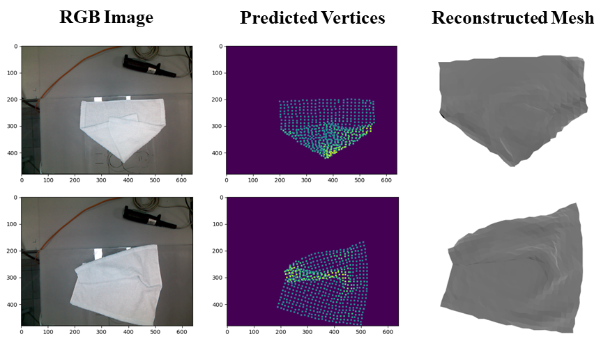

# RaggeDi: Diffusion-based State Estimation of Disordered Rags, Sheets, Towels and Blankets

This is a repository for the paper "RaggeDi: Diffusion-based State Estimation of Disordered Rags, Sheets, Towels and Blankets".
RaggeDi is a diffusion-based method that estimates the 3D folding state of square shaped cloth based on an input RGBD image.
The code for data generation is based on [fabric-vsf repository](https://github.com/ryanhoque/fabric-vsf) and the code for network structure is based on [diffusion policy repository](https://github.com/real-stanford/diffusion_policy).

<p align="center">
<br>
</p>

## Installation
The required modules to train and test a model are installed via requirements.txt:
```shell
conda create -n raggedi python=3.10.14
conda activate raggedi
pip install -r requirements.txt
```


* **Installation of Matlab Engine API for Python**

We use an existing SPR code online (in the next section). Since it is programmed in matlab, to call the matlab with python, it is necessary to install the Matlab engine API for python. The step by step instruction is available in (https://www.mathworks.com/help/matlab/matlab_external/install-the-matlab-engine-for-python.html). This step can be skipped if the user doesn't want to fine-tune the result or rerun the comparison experiment with SPR.


* **Installation of SPR**

In our code, we provide the choice of fine-tuning the result predicted by DDPM model with point cloud registeration. We use the [structure preserved registration (SPR)](https://journals.sagepub.com/doi/abs/10.1177/0278364919841431) to fine-tune the predicted mesh. The SPR code is available in (https://github.com/thomastangucb/SPR). After cloning the SPR repository in the root folder of this repo, please move `add_paths.m` and `run_SPR.m` into `RaggeDi/SPR/`. This step can be skipped if the user doesn't want to fine-tune the result or rerun the comparison experiment with SPR. 
<font color="#dd0000">

* **Installation of fabric-vsf and Data Collection**

To collect data for training/testing, the [fabric-vsf](https://github.com/ryanhoque/fabric-vsf) is required to be installed. It is suggested to create another folder and conda environment to install fabric-vsf. This step can be skipped if the user has an existing dataset.

The detailed instruction about installing the fabric-vsf is available in (https://github.com/ryanhoque/fabric-vsf). Once the installation is finished, please replace the `gym_cloth/envs/cloth_env.py` with the `cloth_env.py` in this repository. It will save the images by disturbing the cloth with a series of pick-and-place actions. 
<font color="#dd0000">

## Datasets and Pre-Trained Models

Download our data and pre-trained model at: [synthetic data](https://drive.google.com/drive/folders/10VVmDiW9g86S-m5z5GrXhi41eUDUMvOt?usp=drive_link), [pretrained model](https://drive.google.com/drive/folders/1ZKDN68sIgh75t_dllh0lwA2N3cHu1Y_7?usp=drive_link), and [real data](https://drive.google.com/drive/folders/15CGpHTAZGeJZxGJAloVsX9vTmzESiwmJ?usp=sharing). To run pre-processing, the raw data needs to be extracted.

You should get a directory structure similar to the following:
```shell
├── RaggeDi
│   ├── whole.ipynb
│   ├── requirements.txt
│   ├── data
│       ├── state_dict.npy
│       ├── raw
│           ├── state_dict.npy
│           ├── episode_0
│           ...
│       ├── training
│           ├── data.npy
│           ...
│       ├── testing
│           ├── data.npy
│           ...
│   ├── model
│           ├── DDPM_32_64_128_100_iters_120000_wnoise_epoch_2000_newest.ckpt
│           ...
│   ├── SPR
│       ├── add_paths.m
│       ├── run_SPR.m
│       ├── CPD2
│           ├── ...
│       ├── SPR
│           ├── ...
│       ...
│   ├── real
│       ├── utils.py
│       ├── Experiment_real.ipynb
│       ├── data_real
│           ├── 1
│           ├── 2
...
```

## Getting Started

To run the visualized demo with an existing testing dataset, open `whole.ipynb` in jupyter notebook and run cells in sections `Import Modules -> Utils -> Network Definition -> Demo with Visualization`.

To perform pre-processing with visualization, open `whole.ipynb` and run cells `Import Modules -> Utils -> Data Pre-processing`. To turn off visualization, set `show=False`. The processed data will be partitioned and saved as `data.npy` in the training/testing data folder separately. The visualized data is saved as images in the folder of each episode. 

To train a model with an existing trainig dataset, open `whole.ipynb` and run cells `Import Modules -> Utils -> Network Definition -> Dataset Definition -> Training`. Note that training a new model may overwrite the downloaded pretrained model. During testing, make sure the right model is used.

To run a demo real world experiment, navigate to the `real` folder by `cd real` and run `Experiment_real.ipynb` block by block. Please make sure the data_real is placed under the right path.

To run experiments with SPR using an existing model and testing dataset, open `whole.ipynb` and run cells `Import Modules -> Utils -> Network Definition -> Dataset Definition -> Numerical Experiments`.

## Citation
If you find this code useful in your work, please consider citing
```shell
@article{ye2024raggedi,
  title={RaggeDi: Diffusion-based State Estimation of Disordered Rags, Sheets, Towels and Blankets},
  author={Ye, Jikai and Li, Wanze and Khan, Shiraz and Chirikjian, Gregory S},
  journal={arXiv preprint arXiv:2409.11831},
  year={2024}
}
```
